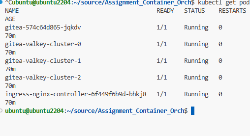
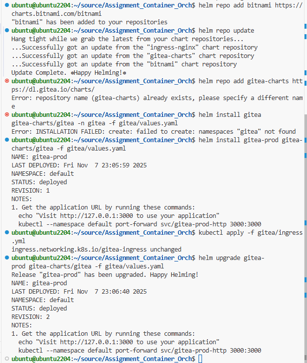
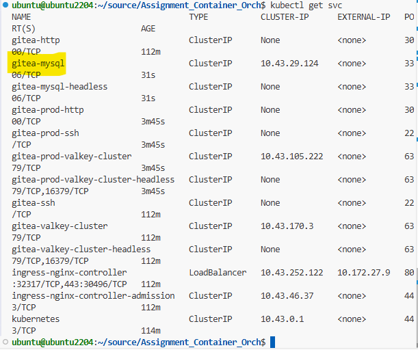
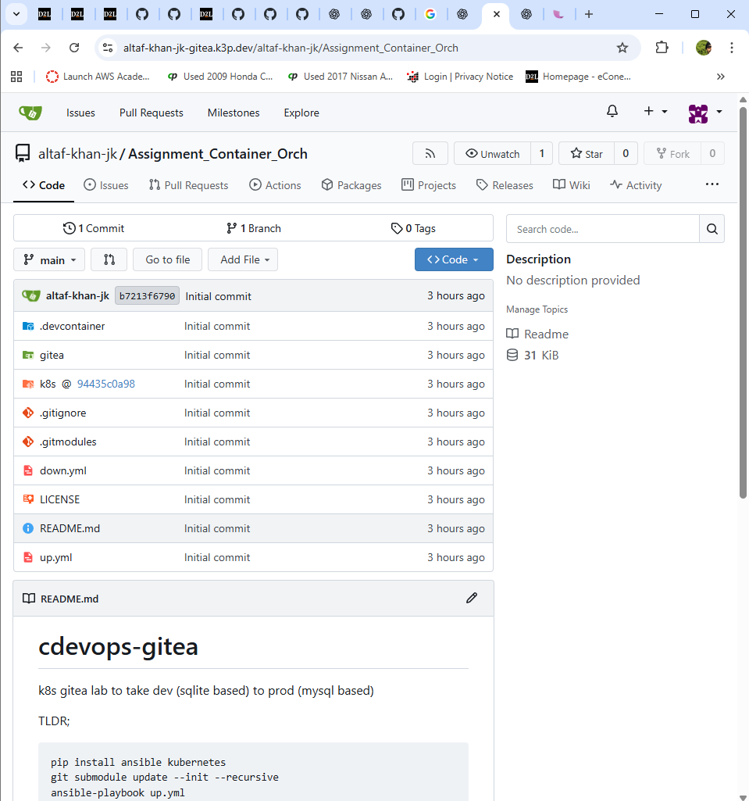

# cdevops-gitea
k8s gitea lab to take dev (sqlite based) to prod (mysql based)

TLDR;

```bash
pip install ansible kubernetes
git submodule update --init --recursive
ansible-playbook up.yml
```

Wait until `kubectl get pod` shows all pods running and:


```bash
kubectl port-forward svc/gitea-http 3000:3000
```

Now you should be able to access gitea in development mode.

The challenge is to run this in production mode.



